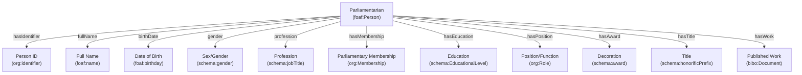
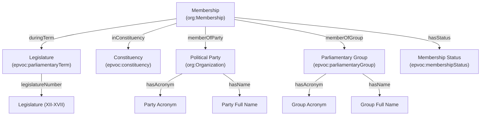
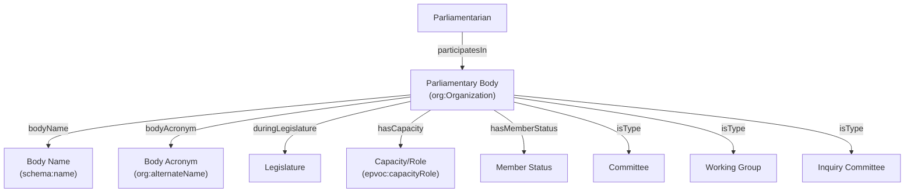
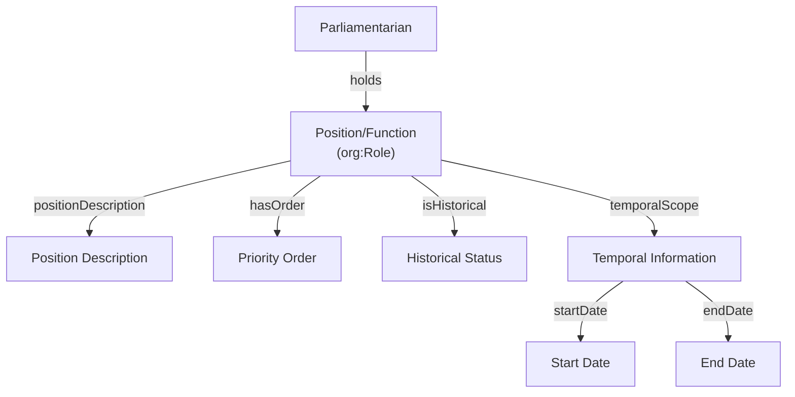
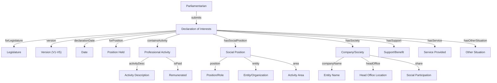
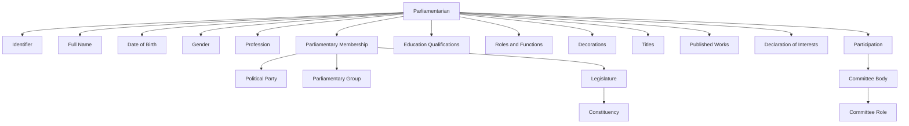

# Conceptual Model Diagrams

This document contains modular mermaid diagrams showing the conceptual model for the Portuguese Parliament Biographical Records (RegistoBiografico).

---

## Diagram 1: Core Person Entity

---

## Diagram 2: Parliamentary Membership and Terms

---

## Diagram 3: Parliamentary Bodies and Committees

---

## Diagram 4: Positions and Functions

---

## Diagram 5: Declarations of Interests

---

## Diagram 6: Full Overview

---

## Summary of Key Relationships

| Relationship | Source | Target | Property |
|--------------|--------|--------|----------|
| Person → Membership | foaf:Person | org:Membership | org:hasMembership |
| Membership → Legislature | org:Membership | epvoc:parliamentaryTerm | epvoc:memberDuring |
| Membership → Party | org:Membership | org:Organization | org:memberOf |
| Person → Position | foaf:Person | org:Role | org:holds |
| Person → Committee | foaf:Person | org:Organization | org:memberOf |
| Declaration → Person | Declaration | foaf:Person | schema:author |
| Education → Person | foaf:Person | skos:Concept | schema:educationalLevel |
